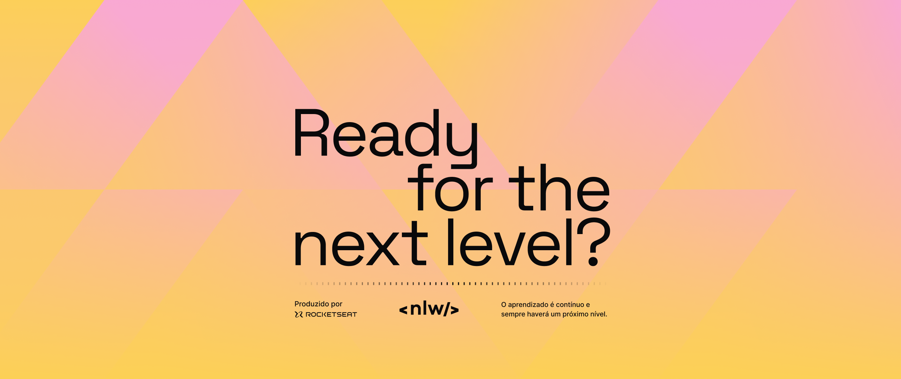

  
  
  
  
  

 

  <a href="#api">API</a> &#xa0; | &#xa0; 
  <a href="#web">Web</a> &#xa0; | &#xa0;
  <a href="#memo-licença">Licença</a>

 

# Next Level Week Pocket 
Conheça o in.Orbit
Uma aplicação para gerenciamento de metas gamificada, onde o usuário cadastra metas semanais e pode controlar em tempo real a pontuação.

#  :book: Módulos
###  _**Stage 01: API Server - Nodejs**_
  Neste módulo, foi desenvolvido toda API da nossa aplicação, contendo configurações de rotas e use cases com todas as funcionalidades. 

  🔗  [API Server](https://github.com/RodrigoLuigi/nlw-pocket/tree/main/api#top) 

###  _**Stage 02: Frontend Web - ReactJs**_
  Neste módulo, foi desenvolvido uma aplicação web para que usuários possam criar bolões da copa e compartilhar o código do bolão para que outros usuários possam participar.

  🔗  [Frontend Web](https://github.com/RodrigoLuigi/nlw-pocket/tree/main/web#top) 

 

## :memo: Licença ##
 MIT License. Para mais detalhes veja em [LICENSE](./LICENSE).

&#xa0;

_**Feito por <a href="https://github.com/RodrigoLuigi" target="_blank">Rodrigo Luigi</a>**_  👨‍🚀 :rocket:

<a href="#top">Back to top</a>

