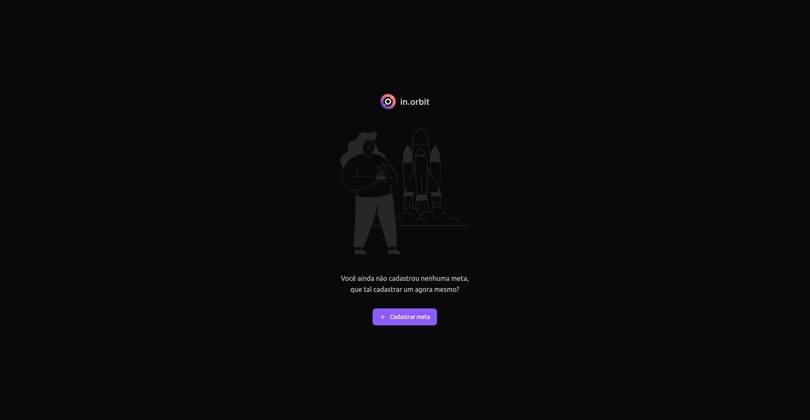
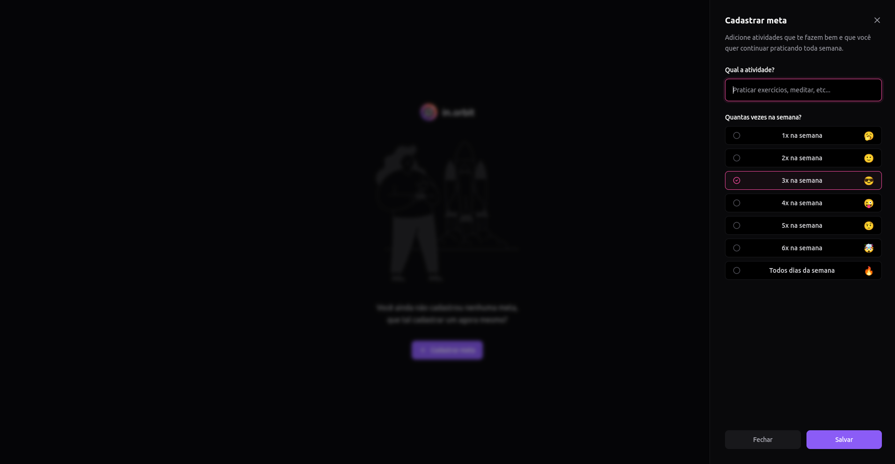
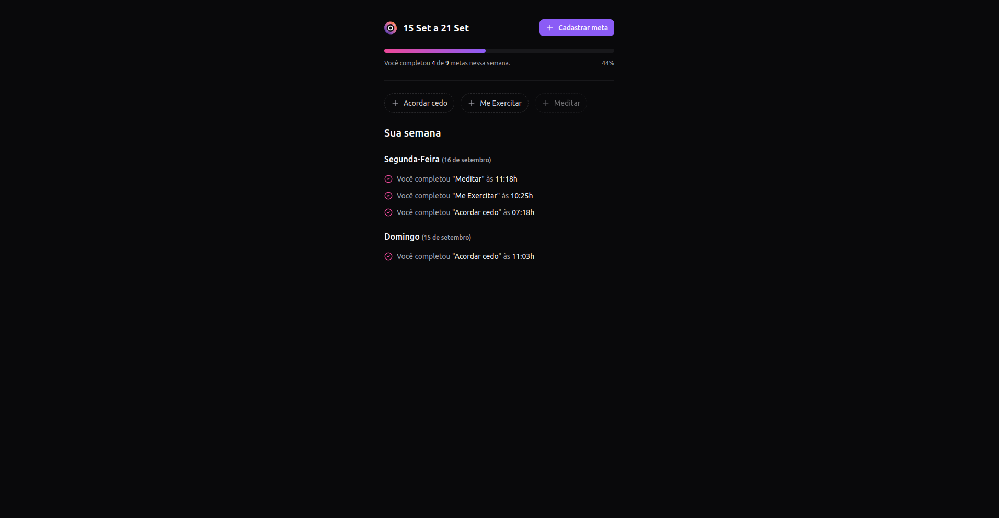

# <h1 id="top" align="center">NLW Pocket 📋📆 Projeto Web Frontend </h1>

<p align="center">
  <a href="#sobre">Sobre</a> &#xa0; | &#xa0; 
  <a href="#-features">Features</a> &#xa0; | &#xa0;
  <a href="#-tecnologias">Tecnologias</a> &#xa0; | &#xa0;
  <a href="#-requisitos">Requisitos</a> &#xa0; | &#xa0;
  <a href="#checkered_flag-iniciando">Iniciando</a> &#xa0; | &#xa0;
  <a href="https://github.com/RodrigoLuigi" target="_blank">Author</a>
</p>

<br>

## Screenshots

<div align="center">
  
  
  
</div>

<br><hr>

##  _**O que desenvolvemos neste Projeto?**_

Desenvolvimento de uma aplicação front-end em ReactJS, aplicação dos conceitos de Propriedades, Estados e Componentes, tipagem com Typescript, tooling com Vite, interface responsiva com TailwindCSS, consumo de API Node.js, gerenciamento de dados assíncronos com TanStack Query.

## ⚙️ Features ##

:heavy_check_mark: Criação de metas\
:heavy_check_mark: Registro de metas completas\
:heavy_check_mark: Listagem de metas por dia da semana

## 👨‍💻 Tecnologias

| Ferramenta      | Descrição                                                                               |
| --------------- | --------------------------------------------------------------------------------------- |
| [ReactJs](https://react.dev/) | Biblioteca JavaScript para construir interfaces de usuário.                |
| [TypeScript](https://www.typescriptlang.org/) | Superset do JavaScript que adiciona tipagem estática.         |
| [Vite](https://vitejs.dev/)   | Ferramenta de build rápida para projetos web modernos.                     |
|                               | Instalação: `npm create vite@latest`                                       |
|                               | Inicializar projeto com Vite: `npm create vite@latest my-app`              |

---

## 📚 Bibliotecas

| Biblioteca      | Instalação                                                                              |
| --------------- | --------------------------------------------------------------------------------------- |
| [Biome](https://biomejs.dev/)                  | `npm i @biomejs/biome -D`                                       |
| [Tailwind CSS](https://tailwindcss.com/)       | `npm install -D tailwindcss postcss autoprefixer`               |
| PostCSS e Autoprefixer                         | Inicializar Tailwind: `npx tailwindcss init -p`                 |
| [Lucide React](https://www.npmjs.com/package/lucide-react) | `npm i lucide-react`                                         |
| [Tailwind Merge](https://www.npmjs.com/package/tailwind-merge) | `npm i tailwind-merge`                                   |
| [Radix UI - Radio Group](https://www.npmjs.com/package/@radix-ui/react-radio-group) | `npm i @radix-ui/react-radio-group` |
| [Radix UI - Progress](https://www.npmjs.com/package/@radix-ui/react-progress) | `npm i @radix-ui/react-progress` |
| [Radix UI - Dialog](https://www.npmjs.com/package/@radix-ui/react-dialog) | `npm i @radix-ui/react-dialog`   |
| [Tailwind Variants](https://www.npmjs.com/package/tailwind-variants) | `npm i tailwind-variants`             |
| [TanStack React Query](https://tanstack.com/query/latest) | `npm i @tanstack/react-query`                             |
| [Day.js](https://day.js.org/)                 | `npm i dayjs`                                                   |
| [React Hook Form](https://react-hook-form.com/) e [HookForm Resolvers](https://www.npmjs.com/package/@hookform/resolvers) | `npm i react-hook-form @hookform/resolvers` |
| [Zod](https://www.npmjs.com/package/zod)      | `npm i zod`                                                     |


## 📝 Requisitos ##

- [Git](https://git-scm.com) 
- [Node](https://nodejs.org/en/)
- [npm](https://www.npmjs.com/)

## :checkered_flag: Iniciando ##

```bash
# Clone este projeto
$ git clone https://github.com/RodrigoLuigi/nlw-pocket.git
# Acesse o projeto
$ cd web
# Instale as dependências
$ npm install
# Execute o projeto com npm
$ npm run dev
# O Server irá inicializar em http://localhost:5173
```


&#xa0;

_**Feito por <a href="https://github.com/RodrigoLuigi" target="_blank">Rodrigo Luigi</a>**_  👨‍🚀

<a href="#top">Back to top</a>


